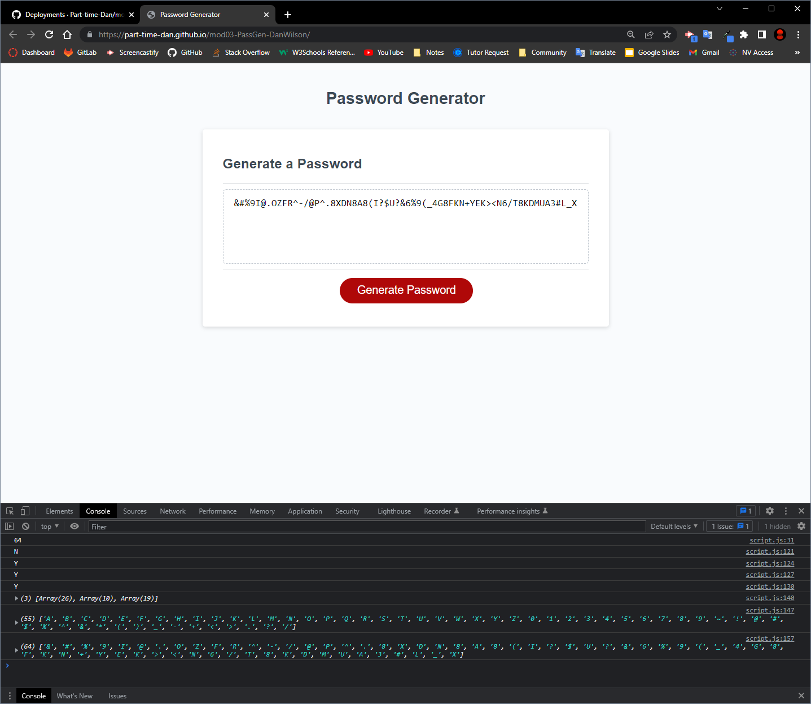

# mod03-PasswordGenerator-DanWilson

## Description
Module 03 challenge for bootcamp to create a functioning random password generator in Javascript. Site has dynamic elements that allow the user to define parameters of the password through window prompts and get the output in the HTML body.

Objectives:

- Criteria specified the password generator should present user with a series of "prompts"
- User should be able to choose length (8 - 128 characters) and some character attributes
- User selections should be validated
- The passowrd is output (either in alert or on the page) with the matching selected criteria

Addition Note: *While a password generator can be made more user-friendly using HTML elements to create an interactive UI in the page, the criteria and course instruction heavily suggested to try and only make the password generator using Javascript and prompts. All the HTML linking elements were provided in the JS starter code, and no HTML or CSS was modified for this assignment other than directory pathing fixes.*

## Installation

N/A

## Usage

Visit the site here [Dan's Password Generator](https://part-time-dan.github.io/mod03-PassGen-DanWilson/)

Click the big red "Generate Password" button and receive several prompts requesting user inputs. 

Console.log outputs are included so users can verify how their inputs are registered and tested in Javascript. Use Chrome Dev tools to 'Inspect' and open the Console while you run the password generator.

### Issue

Currently the first conditional check for character limit isn't optimized, and trying to 'Cancel' or refresh during this prompt results in looping, the loop will continue if a valid response of 8 through 128 is entered. If a refresh is performed during the looping, when the user completes the process, no password will be generated so they must click the button to restart and follow the prompts again.

## Contributions

Starter HTML/CSS pulled from bootcamp course repo.

## License

N/A

## Deploy Git Page Screenshot

